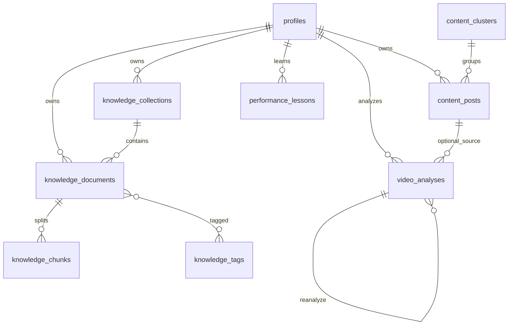

# FormCraft Database

## Migrations

| File | Purpose |
|------|---------|
| `supabase/migrations/20260809051923_create_profiles.sql` | Profiles + signup trigger |
| `supabase/migrations/20260809051934_create_knowledge_schema.sql` | Teach FormCraft + knowledge storage |
| `supabase/migrations/20260809051937_create_my_content_schema.sql` | My Content intelligence |
| `supabase/migrations/20260809051941_create_video_analysis_schema.sql` | Video Breakdown Lab |

Apply with Supabase CLI against a linked project or local stack:

```bash
npx supabase db push
# or
npx supabase start && npx supabase db reset
```

## ERD (simplified)



## Knowledge tables

### knowledge_collections
`id`, `user_id`, `name`, `description`, `created_at`, `updated_at`  
Unique `(user_id, lower(name))`

### knowledge_documents
Spec fields plus `include_in_ai`, `is_archived`, `is_demo`, `is_favourite`, `search_vector`

Statuses: `uploaded | processing | ready | failed`

### knowledge_chunks
`embedding vector(1536)` nullable; unique `(document_id, chunk_index)`

### knowledge_tags / knowledge_document_tags
Per-user tag names; join table RLS via document ownership

## My Content tables

### content_posts
Platform, source provenance, caption/transcript/hook/topic/format, nullable metrics, classification JSON, winner/review flags

### content_clusters
User-renamable clusters

### performance_lessons
`lesson`, `evidence`, `confidence`, `sample_size`, `status` (`suggested|confirmed|rejected|expired`)

### content_experiments / content_weekly_reports
Experiment tracking and weekly report JSON storage

## Analyze tables

### video_analyses
Mode, subject/input types, transcript/media hashes, evidence flags, `result` JSONB, versioning via `parent_analysis_id`

### saved_patterns
Reusable hooks/structures saved from analyses or winners

## Storage buckets (private)

| Bucket | Path convention |
|--------|-----------------|
| `knowledge-files` | `{user_id}/{document_id}/{filename}` |
| `content-media` | `{user_id}/...` |
| `analysis-media` | `{user_id}/...` |

## RLS

Every table enables RLS with `auth.uid() = user_id` (or ownership join for tag pivot / storage folder prefix).

## Indexes

- Knowledge: user+collection, user+status, created_at, GIN `search_vector`
- Content posts: user+published_at, platform, GIN `search_vector`
- Analyses: user+created_at, transcript_hash+mode
