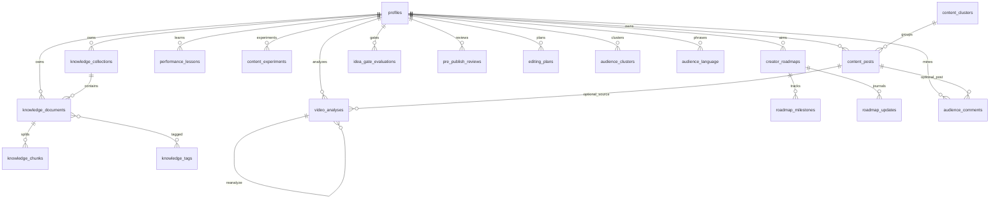

# FormCraft Database

## Migrations

| File | Purpose |
|------|---------|
| `supabase/migrations/20260809051923_create_profiles.sql` | Profiles + signup trigger |
| `supabase/migrations/20260809051934_create_knowledge_schema.sql` | Teach FormCraft + knowledge storage |
| `supabase/migrations/20260809051937_create_my_content_schema.sql` | My Content intelligence |
| `supabase/migrations/20260809051941_create_video_analysis_schema.sql` | Video Breakdown Lab |
| `supabase/migrations/20260809054814_create_creator_growth_schema.sql` | Creator Growth foundations (Roadmap, Experiment Lab expand, Idea Gate, Pre-Publish, Editing plans, Audience Miner) |
| `supabase/migrations/20260809104334_create_social_connections_schema.sql` | Owned social connections, OAuth credentials (service-role only), sync jobs, metric snapshots, post dedupe |
| `supabase/migrations/20260809131644_create_growth_g_intelligence_schema.sql` | Audience insights, roadmap suggestions, AI usage, intelligence feedback, lesson/classification extensions |

Apply with Supabase CLI against a linked project or local stack:

```bash
npx supabase db push
# or
npx supabase start && npx supabase db reset
```

## ERD (simplified)



## Knowledge tables

### knowledge_collections
`id`, `user_id`, `name`, `description`, `created_at`, `updated_at`  
Unique `(user_id, lower(name))`

### knowledge_documents
Spec fields plus `include_in_ai`, `is_archived`, `is_demo`, `is_favourite`, `search_vector`

Statuses: `uploaded | processing | ready | failed`

### knowledge_chunks
`embedding vector(1536)` nullable; unique `(document_id, chunk_index)`

### knowledge_tags / knowledge_document_tags
Per-user tag names; join table RLS via document ownership

## My Content tables

### content_posts
Platform, source provenance, caption/transcript/hook/topic/format, nullable metrics, classification JSON, winner/review flags

### content_clusters
User-renamable clusters

### performance_lessons
`lesson`, `evidence`, `confidence`, `sample_size`, `status` (`suggested|confirmed|rejected|expired`)

### content_experiments / content_weekly_reports

Base experiment tracking from My Content migration, **expanded** by creator growth migration:

| Column | Notes |
|--------|-------|
| `hypothesis` | Required (existing) |
| `test_plan` | Existing free-text plan |
| `primary_variable` | Additive |
| `variants` | jsonb array, default `[]` |
| `control_variables` | jsonb object, default `{}` |
| `primary_metric` | Additive |
| `secondary_metrics` | jsonb array, default `[]` |
| `target_sample_per_variant` | Additive |
| `status` | `experiment_status` (extended with `draft`, `concluded` where supported) |
| `observations` | Additive free-text |
| `conclusion_state` | enum `inconclusive|validated|invalidated|needs_more_data` |
| `conclusion` | Existing free-text |
| `post_ids`, `metrics`, `result` | Existing |
| timestamps | `created_at`, `updated_at` |

Weekly reports remain JSON storage for future generation.

## Analyze tables

### video_analyses
Mode, subject/input types, transcript/media hashes, evidence flags, `result` JSONB, versioning via `parent_analysis_id`

### saved_patterns
Reusable hooks/structures saved from analyses or winners

## Creator Growth tables

Personal-user first: every table has `user_id` and RLS `auth.uid() = user_id`. Schema stays extensible via `metadata` / `evidence` / `result` / `plan` jsonb and `related_ids`.

### creator_roadmaps
`id`, `user_id`, `goal`, `current_phase`, `progress_pct` (0–100), `status` (`active|paused|completed|archived`), `metadata`, timestamps

### roadmap_milestones
`id`, `roadmap_id`, `user_id`, `title`, `category` (text type/category), `status` (`not_started|in_progress|done|blocked|skipped`), `target_value`, `current_value`, `source_kind` (`auto|manual|ai_suggested`), `evidence` jsonb, `notes`, `deadline`, `sort_order`, timestamps

### roadmap_updates
Append-only journal: `roadmap_id`, optional `milestone_id`, `user_id`, `source_kind`, `summary`, `details` jsonb, `created_at`

### idea_gate_evaluations
`user_id`, `idea_text`, `recommendation` (`pursue|reshape|park|kill`), `why`, `evidence`, `risks`, `missing_ingredient`, `better_angle`, `best_format`, `status`, `related_ids` jsonb, timestamps

### pre_publish_reviews
`user_id`, `source_type`, `source_ref`, `input_text`, `result` jsonb, `status` (`draft|reviewed|approved|needs_revision|archived`), timestamps

### editing_plans
`user_id`, `source_ref`, `plan` jsonb, timestamps — UI deferred; table ready for Editing Copilot

### audience_comments
`user_id`, `source` (`manual_paste|csv_import|connected_account|other`), `body`, nullable `post_id` → `content_posts`, `metadata`, timestamps

### audience_clusters
`user_id`, `name`, `cluster_type`, `summary`, `comment_ids` uuid[], `opportunity_text`, timestamps

### audience_language
`user_id`, `phrase`, `category`, `frequency`, timestamps

## Storage buckets (private)

| Bucket | Path convention |
|--------|-----------------|
| `knowledge-files` | `{user_id}/{document_id}/{filename}` |
| `content-media` | `{user_id}/...` |
| `analysis-media` | `{user_id}/...` |

## RLS

Every table enables RLS with `auth.uid() = user_id` (or ownership join for tag pivot / storage folder prefix). Growth tables follow the same ownership model for personal-use first; no shared-workspace policies yet.

## Indexes

- Knowledge: user+collection, user+status, created_at, GIN `search_vector`
- Content posts: user+published_at, platform, GIN `search_vector`
- Analyses: user+created_at, transcript_hash+mode
- Roadmaps: user+status; milestones by roadmap+sort_order
- Idea Gate / Pre-Publish / Audience: user+created_at
